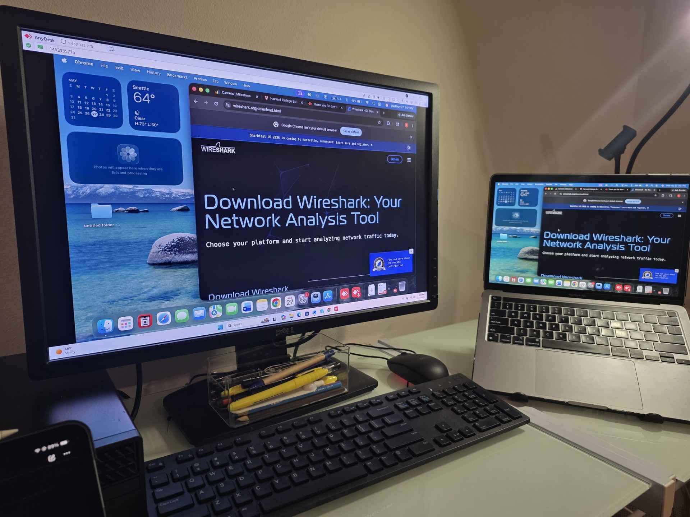
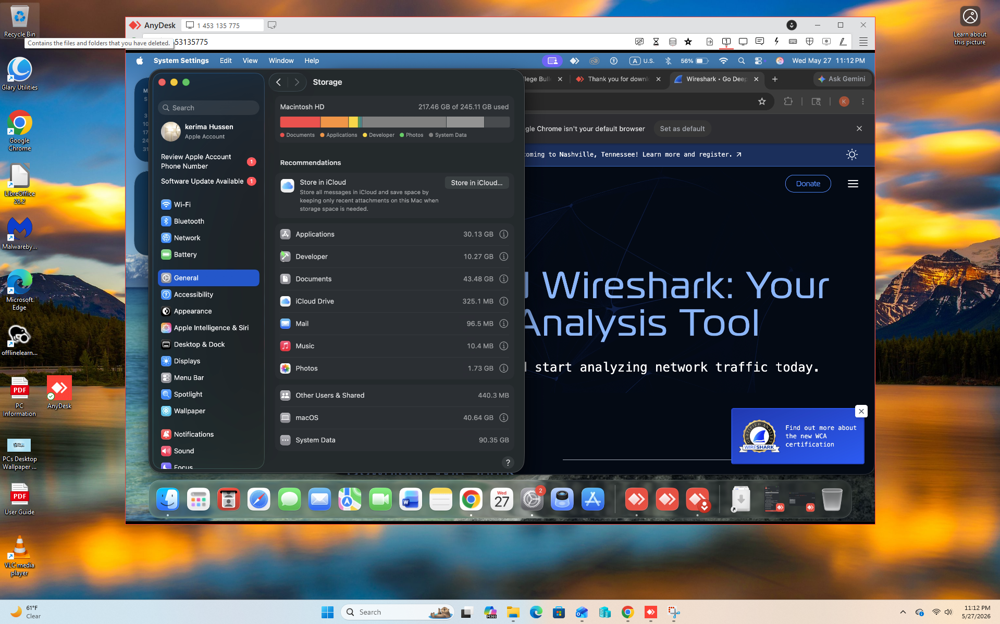
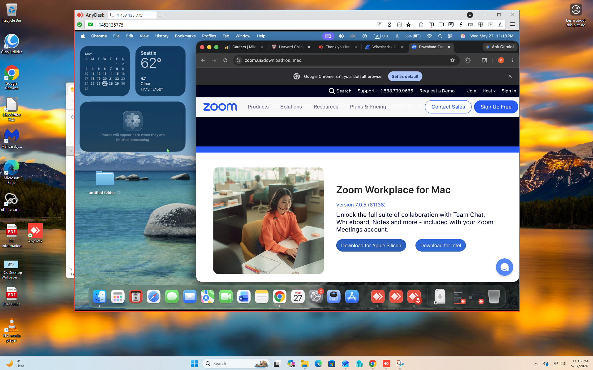

# Remote IT Support Lab Using AnyDesk
## Lab Setup

This project demonstrates hands-on remote help desk support using AnyDesk. The goal of this lab was to simulate real-world IT support scenarios and strengthen practical troubleshooting skills commonly used in entry-level Help Desk and IT Support roles.

The project focused on remote desktop support tasks such as establishing remote connections, requesting and granting user access, controlling remote systems, transferring files, installing and uninstalling software, navigating Windows settings, and communicating professionally with users during troubleshooting sessions.

## Project Objectives
- Practice remote desktop support in a simulated help desk environment
- Gain experience troubleshooting Windows operating systems remotely
- Improve communication and documentation skills during support sessions
- Learn how to assist users through remote access tools
- Build a portfolio-ready IT support project for GitHub and resume use

## Tools Used
- AnyDesk
- Windows Control Panel
- Device Manager
- File Explorer
- Windows Settings
- Task Manager

## Skills Demonstrated
- Remote desktop support
- Remote connection setup and management
- Software installation and removal
- File transfer between systems
- Windows troubleshooting
- User communication
- Troubleshooting documentation
- Help desk ticket writing
- Basic system administration
- Customer support workflow

## Lab Activities
- Connected to remote devices using AnyDesk
- Requested and approved remote access permissions
- Installed and tested software remotely
- Used Control Panel and Windows Settings for troubleshooting
- Transferred files between technician and user systems
- Assisted users through chat and remote sessions
- Practiced documenting troubleshooting steps and resolutions
- Simulated common IT support requests and issue resolution

## Example Scenarios
- Installing web browsers and productivity software remotely
- Troubleshooting slow computer performance
- Assisting users with Windows settings and configuration
- Transferring files securely between devices
- Helping users locate installed programs and system information
- Simulating remote support communication with end users

## Outcome
This project improved my understanding of remote IT support workflows and strengthened my practical troubleshooting, communication, and documentation skills in a help desk environment.

## Screenshots

### Remote Session 

### Software Installation

### File Trasnfer

### Task Manager Troubleshooting

